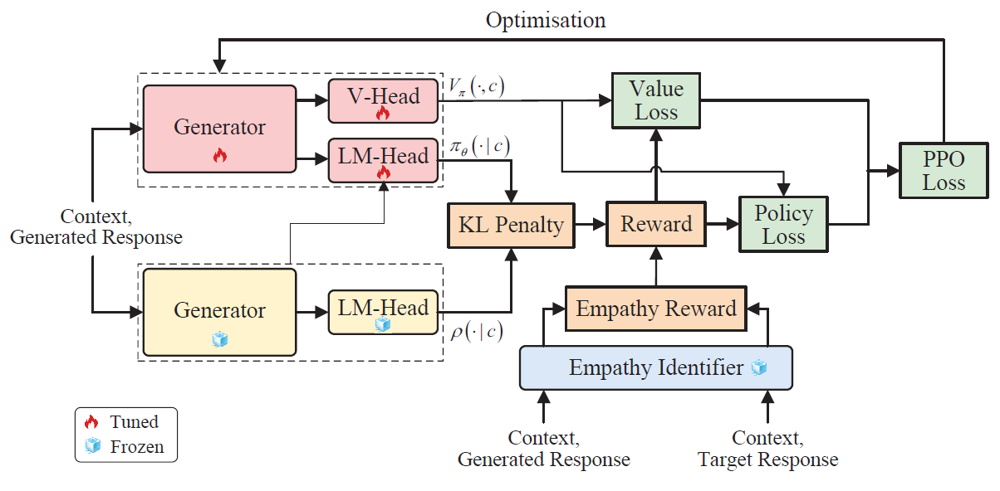

# SDT
This repository is the implementation for our paper ***Empathy Level Alignment via Reinforcement Learning for Empathetic Response Generation***
<!-- (https://ieeexplore.ieee.org/abstract/document/10109845)*. -->

## Model Architecture
<!--  -->
<div align="center">
    
</div>

## Setup
- Check the packages needed or simply run the command:
```console

pip install -r requirements.txt
```
- Download the preprocessed datasets from [here](https://drive.google.com/drive/folders/16JPd75eSylpB9G6HKFf89aoG7wZipJTf?usp=drive_link), and put them into `data/`.
- Download the trained empathy identifiers from [here](https://drive.google.com/drive/folders/1FEA9KoW1rf2Sfz9swHWmECqvcZyuidbo?usp=drive_link), and put them into `saved/`.

## Run EmpRL
- Generator Fine-tuning:
```console
bash run_dialog.sh
```
- RL Training:
```console
bash run_dialog_ppo.sh
```
- Response Generation:
```console
bash run_dialog_eval.sh
```
